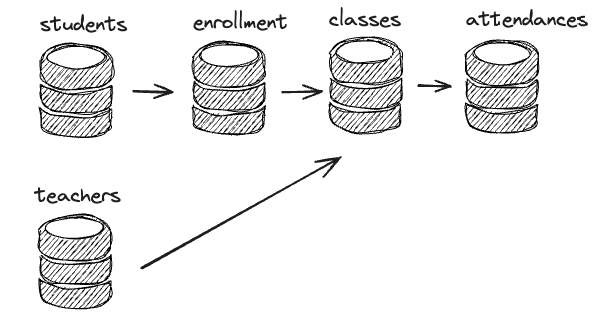

# School Management System

## Description

I have created a basic API to showcase some cool features that I have developed in past projects. Although I can't share the actual codebases due to legal and ethical reasons, this API demonstrates my skills and experience in various aspects of software development.


## Features

- API + JWT (Bearer Authentication)
- API Rate Limit for Auth and Anom users
- API versioning example StudentViewSet
- Custom queryset (Students)
- Model Validation (Attendance)
- Email for stake holder when trigger activated
- RabbitMQ queue to handle user creation
- Django Commands to populate database and call consumers
- Pytest
- 
- Read CSV Files from commands
- Linter and Code Quality with Ruff
- Docker and Docker Compose Features

## Requirements

- Python 3.10+
- Django
- PostgreSQL
- Docker

## Databases

#### Students (1 - N) -> Enrollments (1 - 1) -> Classes (1 - N) -> Enrollments
#### Teachers (1 - N) -> Classes



## Setup

### Clone the repository

```sh
git clone https://github.com/yourusername/school-management-system.git
cd school-management-system
```

### Create .env 

``` 
SECRET_KEY=your-secret-key
DEBUG=True
ACCESS_TOKEN_LIFETIME=5
REFRESH_TOKEN_LIFETIME=1
POSTGRES_DB=mydatabase
POSTGRES_USER=myuser
POSTGRES_PASSWORD=mypassword
POSTGRES_HOST=db
POSTGRES_PORT=5432
DJANGO_TEST_ENV=True
CELERY_BROKER_URL=amqp://guest@rabbitmq//
RABBITMQ_HOST=rabbitmq
RABBITMQ_PORT=5672
RABBITMQ_USER=guest
RABBITMQ_PASSWORD=guest
```

### Run this project with Docker

``` 
docker-compose build
``` 

Everytime that you apply new features, make sure to run the build command to build a new docker instance with the latest features

``` 
docker-compose up
```
or

``` 
docker-compose up --build
``` 

### Populate Database 

``` 
docker-compose run web python manage.py populate_db src/students/temp/students_2024_07_15.csv
``` 


### Call Producer/Consumer

``` 
docker-compose run web python manage.py send_students
``` 

``` 
docker-compose run web python manage.py consume_students
``` 

### You can check the messages at RABBITMQ Interface

user: guest
password: guest


### Semantig Commits Flag

feat: for new features
test: when increasing or fixing testing coverage
fix: for fixing issues or mismatching characters
